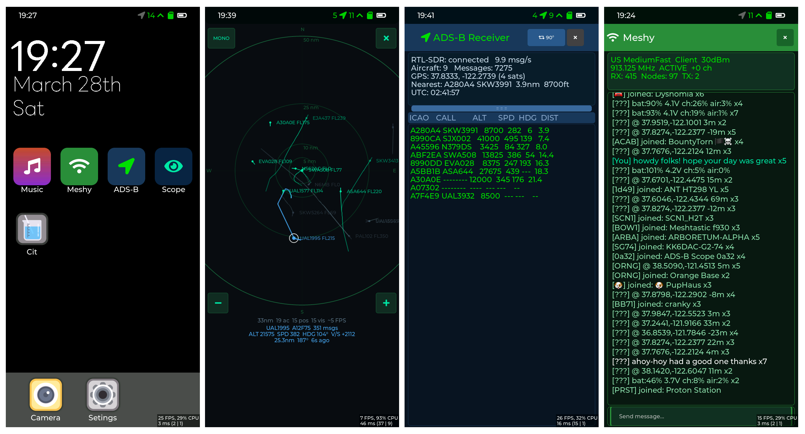
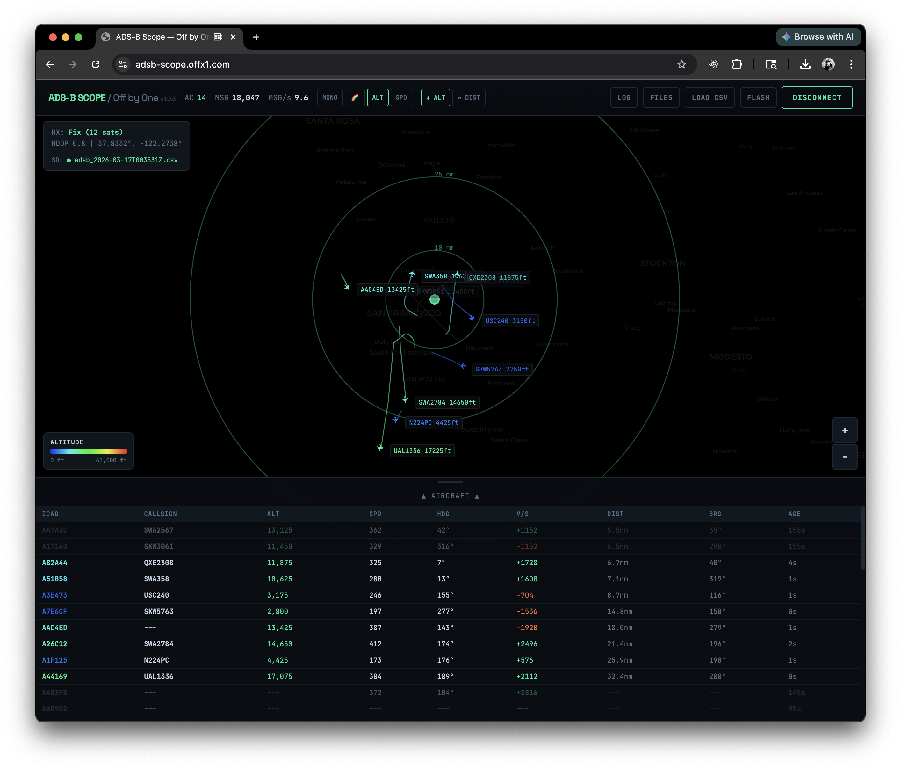

<!--
 * @Description: ADS-B Receiver on LILYGO T-Display-P4
 * @Author: John Stockdale / Off by One (fork of LILYGO_L original)
 * @Date: 2025-06-13 15:12:02
 * @LastEditTime: 2026-04-09
 * @License: GPL 3.0
-->
<h1 align="center">ADS-B Scope – T-Display-P4</h1>

<p align="center">
  A portable 1090 MHz ADS-B receiver and Meshtastic-compatible mesh radio built on the LILYGO T-Display-P4, using an RTL-SDR USB dongle for RF reception, an SX1262 LoRa radio for mesh networking, and the ESP32-P4's dual RISC-V cores for real-time signal processing.
</p>

## Overview

This project turns a LILYGO T-Display-P4 development board into a portable ADS-B receiver, Meshtastic-compatible mesh radio, and (yes, really) an mp3 player 🎵. An RTL-SDR dongle connected via USB Host receives 1090 MHz transponder signals, which are decoded in real-time on the ESP32-P4. The onboard SX1262 LoRa radio runs a Meshtastic-compatible mesh network for off-grid messaging. Decoded aircraft and mesh messages are displayed on the built-in touchscreen, logged to SD card, and can be viewed live via the companion web app, ADS-B Scope.



### What works today

- **On-device ADS-B display** – touchscreen UI with aircraft table (ICAO, callsign, altitude, speed, heading, distance, message count), stats panel (message rate, GPS, nearest aircraft, UTC time), draggable divider between panels, 4-way screen rotation toggle (persists across app visits)
- **On-device radar scope** – canvas-drawn aircraft positions with range rings, historical trails with per-segment altitude/speed coloring, pan/zoom, aircraft selection, and helicopter silhouette icons for rotorcraft
- **Aircraft database** – 587K-record database on SD card (`aircraft.db`, built from OpenSky data) with PSRAM-cached lookups. Enriches aircraft with registration, type, manufacturer, model, owner, operator, and aircraft class (landplane/helicopter/amphibian/gyrocopter/tilt-rotor). Downloadable via CDN from the webapp with CRC32-verified serial transfer.
- **Helicopter icons** – aircraft class from the database drives distinct map icons: top-down rotorcraft silhouette (body + tail boom + rotor blades) on both the webapp and LVGL scope, rotated to heading
- **Unified firmware** – single binary supports both HI8561 LCD (540×1168) and RM69A10 AMOLED (568×1232) display variants via runtime I2C probe detection at boot
- **Real-time ADS-B reception** – 15–30 messages/second, 12–30+ simultaneous aircraft tracked
- **Adaptive gain** – automatic RTL-SDR tuner gain control with two-phase algorithm: fast convergence (P1) and steady-state tracking (P2). Signal quality gating prevents nighttime death spirals. Manual override via webapp gain popover or serial command. Gain state (steady/converging/manual) displayed in webapp.
- **~30 nm range** from Oakland, CA with a 7" telescopic antenna on RTL-SDR
- **USB hot-plug** – RTL-SDR can be connected/disconnected at any time; firmware detects disconnect (10 consecutive read errors), frees stuck USB transfer, and re-initializes cleanly on reconnect. EP0 STALL recovery handles flaky USB connections.
- **Three-state RTL-SDR status** – status bar and CIT page distinguish between disconnected (grey), connected (green), and error (red) states
- **SD card CSV logging** – UTC timestamps, raw Mode-S hex, decoded fields (ICAO, callsign, altitude, speed, heading, vertical rate, position, squawk), receiver GPS metadata (sats, HDOP). PSRAM-buffered writes with periodic flush for clean filesystem state.
- **AXI DMA fence** – SDHOST IDMAC (ESP-Hosted WiFi SDIO) and GDMA-AXI (GP-SPI SD card) share the AXI interconnect; a silicon bus arbitration bug can corrupt FAT structures. All SD file I/O is serialized through `sd_io_take()/sd_io_give()` which acquires the ESP-Hosted SDIO DMA lock, preventing concurrent DMA on the shared bus.
- **SD card hot-remove recovery** – consecutive flush failure counter detects card removal, unmounts dead filesystem, and retries remount every 30 seconds. Card reinsertion resumes logging automatically with fresh log files.
- **USB Mass Storage mode** – on-device UI and serial command (`msc`) to expose the SD card to a connected computer as a USB drive. Pauses ADS-B and Meshy logging, shows transfer stats, and resumes normal operation on disconnect.
- **Serial file transfer** – `recv` command implements CRC32-verified chunked file transfer over USB Serial JTAG. Base64-encoded, 32KB chunks with resume support. CHUNK v1.1 header enables instant truncation detection. `verify_crc32` command provides incremental file verification with progress reporting.
- **OTA firmware update** – `ota_updater.c` downloads firmware from HTTP, streams to SD, verifies SHA256, flashes to OTA partition. Rollback detection with failure marker on SD. Can be triggered via MQTT.
- **MQTT cloud telemetry** – `mqtt_feeder.c` publishes aircraft positions, receiver stats, and gain state over MQTT for remote monitoring. Supports OTA update commands.
- **Meshy mesh networking** – compatible TX/RX on the SX1262 LoRa radio with channel encryption, PKI direct message decryption, node discovery, position/telemetry display, MQTT gateway forwarding, TX echo in message history, packet ID dedup, and configurable hop limit (1–7, default 5).
- **Music player** – SD card MP3 playback via the ES8311 DAC with ID3 tag parsing, cover art display, 512 KB PSRAM readahead buffer, stereo-to-mono downmix, and gapless track scanning. Because every SIGINT platform needs a jukebox 🎶🐱
- **WiFi via ESP-Hosted** – ESP32-C6 coprocessor provides WiFi 6 connectivity over SDMMC Slot 1. SD card runs on SPI3 to avoid the SDMMC DMA conflict (Espressif Issue #17889). NTP time sync when connected. Graceful fallback with goto-based error unwinding if C6 is unresponsive — system continues without WiFi.
- **Time manager** – coordinates GPS, NTP, and RTC time sources with priority and accuracy tracking. GPS is primary (650ms serial delay compensation), NTP provides initial time before GPS fix, RTC seeds POSIX clock at boot for TLS cert validation. System clock stays in `[boot+elapsed]` format until a verified source provides time.
- **GPS timezone with DST** – L76K GNSS (5 Hz) sets the system clock; timezone determined from GPS coordinates using a compiled 0.1° grid covering 61 regions with 12 DST rules; syncs the PCF8563 RTC with local time
- **GPS position validation** – direction string check rejects corrupt NMEA data; jump rejection (>2°) with 3-fix forgiveness catches sign flips while allowing real movement during GPS loss
- **Screenshots** – capture device screen as PNG to SD card via serial command or webapp button. Atomic framebuffer snapshot under LVGL lock (~1ms copy, ~1.3s encode). Base64 transfer over serial for download via webapp.
- **Persistent settings** – all device and radio settings stored in NVS with version-migrated blob, validated on load, deferred writes from LVGL via internal-RAM helper task (PSRAM stack safe)
- **Serial console** – interactive command mode (Ctrl+C) with file management, WiFi/NTP config, USB MSC control, screenshot capture, file transfer (`recv`, `verify_crc32`), gain control, MQTT config, status, version query; ADS-B output buffered and replayed on return to log mode. Console task pinned to core 1 with priority boost during file transfers to maintain full ADS-B throughput on core 0.
- **ADS-B Scope** – WebSerial-based live map viewer with firmware flashing, CSV replay, file browser, Meshy message panel, aircraft database detail cards, helicopter icons, 3D aircraft view, gain control popover, MQTT integration ([adsb-scope.offx1.com](https://adsb-scope.offx1.com))
- **SD card reliability** – power-cycled on boot via XL9535 GPIO to reset card state machine after hard resets; AXI DMA fence prevents WiFi SDIO bus contention; boot counter and device registry in `/sdcard/adsb_scope.cfg`
- **Task priority architecture** – 6-tier FreeRTOS priority scheme: audio DMA (6), serial transfer boost (5), USB host/RTL-SDR (4), GPS/console (3), periodic tasks (2), LVGL rendering (1). Console pinned to core 1 so file transfers don't preempt ADS-B decoding on core 0.
- **Status bar** – dynamic icons for GPS (sat count + fix status), ADS-B (aircraft count + connection state), SD card (mounted/logging/USB), and battery level with automatic spacing based on rendered text width

### Known limitations

- **WebSerial triggers device reboot** – USB-JTAG auto-reset circuit fires on DTR toggle during port open; handled gracefully (scope reconnects, boot log is parsed)
- **WiFi requires C6 flash** – ESP-Hosted slave firmware must be flashed to the ESP32-C6 coprocessor manually. WiFi works when configured but is not yet tested end-to-end in the field.
- **Meshy still under heavy development** – PKI DM sending not yet implemented (receive works). Private channel support implemented but still testing. Device does not yet rebroadcast traffic. Operates similar to CLIENT_MUTE role.

## ADS-B Scope

A self-contained HTML file that connects to the receiver over WebSerial and plots aircraft on a live map.



**Live version:** [adsb-scope.offx1.com](https://adsb-scope.offx1.com)

Features:
- Dark radar-scope aesthetic with Leaflet/CartoDB dark tiles
- Aircraft icons with correct heading rotation and position trails (unlimited length)
- Three.js 3D aircraft view with labeled markers, altitude-scaled positions, and smooth camera controls
- Helicopter silhouette icons for rotorcraft (from aircraft database class field)
- Aircraft detail cards with registration, type, manufacturer, model, owner, operator from aircraft database
- Aircraft database CDN download with CRC32-verified serial upload and on-device verification
- Range rings at 10, 25, and 50 nm
- Receiver position trail (dashed green polyline showing movement history)
- GNSS receiver status, device UTC clock (live/stale indicator), and SD card logging status (separate ADS-B and Meshy indicators)
- Adaptive gain control popover: auto/manual mode toggle, real-time gain slider, dual-range error band editor with presets, gain state display (steady/converging/manual) with color-coded LED
- MQTT integration for remote data streaming (aircraft positions, stats, gain state)
- Aircraft detail panel on selection (click icon or label, multi-select with Cmd/Ctrl+click)
- Sortable aircraft table with drag-resizable panel, message count column, and keyboard navigation (arrow keys, shift-select, escape)
- Detail card bottom position tracks panel height dynamically
- Color modes: MONO (terminal green), RAINBOW (by ICAO hash), ALT (altitude heatmap), SPD (speed heatmap)
- Label modes: altitude or distance from receiver
- Serial log panel with ADS-B/GNSS/Meshy/Other filters and pause-to-inspect
- Meshy panel with live message feed, timestamps, node map overlay, position tracking, text/join/position/telemetry filters, PKI DM detection with "DM" badge, packet-ID-based dedup with multi-reception expansion, TX echo display, and shift+click range selection for node analysis
- Screenshot button — captures device screen and downloads as PNG via base64 serial transfer
- SD card file browser over serial (list, download, replay, delete)
- CSV replay with timeline scrubber and variable speed (0.25×–32×), supporting both ADS-B and Meshy CSV files simultaneously
- Firmware flashing via esptool-js (WebSerial)
- Firmware version checking against `latest.version.json` with update badge
- Google Analytics integration (G-T71ZHWG166) loaded at end of body for offline resilience
- Auto-reconnect after flash
- Responsive layout with touch-friendly targets for mobile use
- DTR/RTS deasserted on connect to minimize resets
- Title attributes on all buttons for accessibility

Requirements: Chrome or Edge (WebSerial API). Connect via USB, click "Connect Serial", select the ESP32-P4 port.

## Serial Console

Press **Ctrl+C** over serial (115200 baud) to enter command mode. Type `log` to return to streaming mode. ADS-B and GNSS output is buffered in PSRAM during command mode (up to 500 lines) and replayed when returning to log mode.

```
help              show available commands
log               return to streaming log mode
ls [path]         list directory (default: /sdcard)
cat <file>        print file contents
head <file> [n]   print first n lines (default 20)
tail <file> [n]   print last n lines (default 20)
rm <file>         delete a file
mv <src> <dst>    rename/move a file
cp <src> <dst>    copy a file
df                show SD card free space
status            show receiver status
version           show firmware version
tz [hours]        show or set UTC offset (e.g. tz -7)
meshy_tx <text>   send Meshy text message (broadcast)
channels          manage Meshtastic channels (list, add, remove, reset)
identity          show/set Meshy node identity
nvs               NVS management (list, dump, clear)
msc               enter USB Mass Storage mode (stops logging)
cdc               exit USB Mass Storage mode (resumes logging)
wifi              WiFi control (on, off, status, ssid <n>, pass <pw>)
ntp               show/set NTP server and poll interval
time              show time source status (GPS, NTP, RTC)
screenshot        save device screen as PNG to SD card
screenshot send   send last screenshot as base64 over serial
recv <path> <sz>  receive file over serial (base64, CRC32-verified, resume)
verify_crc32 <path> <hex>  verify file CRC32 on SD card
gain              show/set RTL-SDR tuner gain (auto, manual, value)
mqtt              MQTT config (on, off, status, server, port, topic)
mount             mount SD card
unmount           safely unmount SD card
reboot            software reset
```

## Meshy – Meshtastic-compatible Mesh Radio

The firmware implements a Meshtastic-compatible LoRa mesh radio using the onboard SX1262 (HPD16A module via SPI). It can send and receive encrypted text messages, broadcast node identity, and interoperate with standard Meshtastic devices on the same channel.

### What it does

- **Channel-encrypted TX/RX** – text messages and NODEINFO broadcasts encrypted with the standard Meshtastic AES-CTR scheme, compatible with any Meshtastic device on the same channel + PSK
- **PKI direct message decryption** – receives X25519/XChaCha20-Poly1305 encrypted DMs addressed to this node, using a persistent keypair stored in NVS. Public key is broadcast in NODEINFO packets.
- **MQTT gateway forwarding** – `ok_to_mqtt` flag encoded in the Data protobuf bitfield (field 9, bit 0) so MQTT gateways forward our packets to the internet. Confirmed working with 34+ gateways across the Bay Area mesh.
- **Node discovery** – receives and stores NODEINFO, position, and telemetry from other nodes (512-node table in PSRAM). Nodes with public keys are tagged `[PKI]`.
- **Configurable settings** – region (US/EU/etc), preset (LongFast through ShortSlow), frequency slot, TX power (10–30 dBm), hop limit (1–7, default 5), role (Client/ClientMute/RouterLate), NODEINFO broadcast period, and MQTT forwarding toggle. All settings persist across reboots.
- **SD card logging** – all decoded messages logged to CSV with timestamps, RSSI, SNR, hop count, port type, decoded payload, and PKI flag. Log files use `mesh_` prefix.
- **TX echo** – sent messages appear in on-device message history and are logged to SD, matched by packet ID
- **Web app integration** – live Meshy panel in ADS-B Scope shows message feed with timestamps, node names, position pins on the map, telemetry readouts, PKI DM badges, packet-ID-based dedup, and radio config display (region, preset, role, TX power, hop count, frequency)

### On-device Meshy UI

- Draggable message panel with text input, floating preview bar, and on-screen keyboard with haptic feedback
- Message canvas with emoji-capable rendering, per-message coloring (TX=accent, RX text=white, system=dim green), and manual word-wrap (1800px scrollable)
- Settings panel: LoRa Radio enable/disable, SD Card Logging, Region, Preset, Freq Slot, OK to MQTT, Hop Limit, TX Power, Role, NODEINFO period
- Factory reset dialog with separate checkboxes for settings, Meshy channels, and PKI keypair

### Architecture notes

- CSMA/CA random backoff before TX (per Meshtastic spec)
- SPI mutex shared between RX polling (50ms) and TX
- RX/TX task stacks on internal RAM (SPI DMA requirement)
- Message history: 1000 slots in PSRAM (376 KB)
- Node table: 512 slots in PSRAM (69 KB)
- NVS writes dispatched to a short-lived internal-RAM task (SPI flash disables cache, making PSRAM inaccessible)

## Music Player 🎵

Because every open-source SIGINT platform deserves a soundtrack 🎧🛩️

The firmware includes an SD card MP3 player using the onboard ES8311 DAC and NS4150B amplifier. Drop `.mp3` files in `/sdcard/music/` and they show up in the on-device player. See `music_README.md` for details on supported formats, album art, and the `prepare_music.py` preparation tool.

### Features

- MP3 decoding via minimp3 (header-only, no external dependencies)
- Stereo-to-mono downmix for the ES8311 mono codec (no content loss)
- ID3v2 tag parsing for track title, artist, and album
- Cover art extraction and display on the AMOLED/LCD screen (max 1024×1024, downscaled to 544×544)
- 512 KB PSRAM readahead buffer with 64 KB chunk fills for gapless playback
- Configurable sample rate via `set_clock_rate()` – 44.1 kHz default, auto-switches per track
- Track scanning at boot with up to 64 tracks
- Readahead fill task on PSRAM stack (4 KB)

## CSV Log Format

### ADS-B log

Logged to `/sdcard/logs/adsb_YYYY-MM-DDTHHMMSSZ.csv` (or `adsb_bootNNNNNNNN.csv` before GPS fix, where the number is a persistent boot counter from `/sdcard/adsb_scope.cfg`):

```
timestamp_utc,raw_msg,icao,callsign,altitude_ft,speed_kt,heading_deg,vrate_fpm,lat,lon,squawk,rx_lat,rx_lon,range_km,bearing_deg,rx_sats,rx_hdop
2026-03-16T04:13:35.123Z,8DA105E8582594BADAC53333EE95,A105E8,SKW5567,6425,285,109,-128,37.72680,-122.44730,0000,37.83328,-122.27379,11.0,233,5,2.7
```

Timestamps are ISO-8601 UTC with millisecond resolution. Raw Mode-S hex is the second column for easy replay. Every row includes receiver GPS sats/HDOP for data quality assessment.

### Meshy log

Logged to `/sdcard/logs/mesh_YYYY-MM-DDTHHMMSSZ.csv` with timestamps, RSSI, SNR, hop count, port type, decoded payload, position, telemetry, and PKI flag.

## SD Card Layout

```
/sdcard/
├── adsb_scope.cfg          # Boot counter + device registry (auto-managed)
├── data/
│   └── aircraft.db         # Aircraft database (ADSBDB02 format, ~27 MB)
├── logs/
│   ├── adsb_*.csv          # ADS-B flight logs
│   └── mesh_*.csv          # Meshtastic message logs
├── firmware/
│   └── ota.bin             # OTA firmware update (downloaded, SHA256-verified)
├── screenshot_*.png        # Device screenshots
└── music/
    ├── README.md           # Music player documentation
    └── *.mp3               # MP3 files with ID3 tags and embedded cover art
```

The `aircraft.db` file is built from the OpenSky Network aircraft database using `build_aircraft_db.py`. Place it in `/sdcard/data/` — the firmware loads the 512 KB bucket header into PSRAM at boot and performs lookups on demand.

## Hardware

### Board: LILYGO T-Display-P4 V1.0

| Component | Detail |
|---|---|
| **SoC** | ESP32-P4, 360 MHz dual RISC-V, 32 MB PSRAM, 16 MB flash |
| **Coprocessor** | ESP32-C6-MINI-1U (WiFi 6 / BLE 5 via SDIO) |
| **Display** | HI8561 LCD 540×1168 or RM69A10 AMOLED 568×1232 (auto-detected at boot) |
| **GPS** | Quectel L76K (UART, 9600→115200 baud auto-detect) |
| **RTC** | PCF8563 (I²C, stores local time with GPS-derived timezone) |
| **LoRa** | SX1262 via SPI (HPD16A module) |
| **Audio** | ES8311 DAC + NS4150B amplifier + electret mic |
| **IMU** | ICM20948 9-axis (I²C) |
| **Battery** | BQ27220 gauge + LGS4056H charger |
| **Camera** | OV2710 MIPI-CSI |
| **IO Expander** | XL9535 (I²C) |
| **Storage** | SD card (SPI3, coexists with ESP-Hosted SDIO on Slot 1; SDMMC 4-bit for USB MSC mode) |

### External: RTL-SDR USB Dongle

Connected via the ESP32-P4's USB 2.0 Host port. The firmware implements a custom USB host driver that initializes the RTL2832U + R820T tuner, tunes to 1090 MHz at 2 MS/s, and reads IQ samples via USB bulk transfers.

## Source Files

All ADS-B firmware source is in `main/examples/lvgl_9_ui/`:

| File | Description |
|---|---|
| `main.cpp` | Boot, peripheral init, GPS task (with position validation), LVGL UI, task orchestration (6-tier priority scheme), screen detection, USB pre-alloc, settings persistence, WiFi init, time manager, MSC/screenshot wrappers, memory checkpoints, AXI DMA fence (`sd_io_take/give`) |
| `class_driver.c / .h` | USB host, RTL-SDR reader task, aircraft table, adaptive gain algorithm (P1/P2 with signal quality gating), SD logging with hot-remove recovery, aircraft DB ICAO log emission, stats with error/gain state |
| `mode-s.c / .h` | Mode S decoder (from dump1090/libmodes) with preamble/CRC/signal statistics for adaptive gain feedback |
| `serial_console.c` | Interactive console with command mode, PSRAM replay buffer, shared `log_format_timestamp`, WiFi/NTP/MSC/screenshot commands, `recv` file transfer (CHUNK v1.1 protocol), `verify_crc32` with progress, gain control, MQTT config. Task pinned to core 1 with priority boost during transfers. |
| `lvgl_ui.cpp / .h` | LVGL UI: ADS-B app, radar scope (with helicopter icons), Meshy app (with preview bar + haptic keyboard), music player, settings panels (WiFi, USB MSC), status bar, CIT tests, rotation persistence |
| `esp_libusb.c / .h` | USB-to-librtlsdr shim, idempotent init, early DMA pre-alloc, EP0 STALL recovery |
| `librtlsdr.c` | RTL-SDR driver (adapted from osmocom) with dongle identification, EEPROM read, bias tee support |
| `tuner_r82xx.c` | R820T/R828D tuner driver with Blog V4/V4L band switching and bias tee GPIO control |
| `device_settings.h` | Settings struct (1024-byte NVS blob), version-migrated load/save, validation, deferred NVS write via internal-RAM task. Includes gain, MQTT, and OTA settings. |
| `meshtastic_task.cpp / .h` | Meshy FreeRTOS tasks: SX1262 RX polling, TX queue with echo, CSMA/CA, node table, message history, SD CSV logging with hot-remove recovery |
| `meshtastic_radio.h` | `MeshSession` class: channel encrypt/decrypt, packet build, PKI decrypt, hop limit, ok_to_mqtt |
| `meshtastic_pb.h` | Meshtastic protobuf encoder/decoder: Data, User, Position, Telemetry, bitfield (ok_to_mqtt) |
| `meshtastic_crypto.h` | AES-CTR channel encryption, X25519 ECDH, XChaCha20-Poly1305 PKI, SHA-256 KDF (mbedtls) |
| `meshy_channels.h` | Channel store (NVS), PSK management, node identity, PKI keypair generation/persistence |
| `aircraft_db.h` | Aircraft database lookup module (header-only, PSRAM cache + SD bucket file, ADSBDB02 versioned format). All SD access wrapped in `sd_io_take/give`. |
| `music_player.cpp / .h` | MP3 player: minimp3 decode, ES8311 DAC output, stereo-to-mono downmix, ID3 parsing, cover art, 512 KB PSRAM readahead. All SD access wrapped in `sd_io_take/give`. |
| `mqtt_feeder.c / .h` | MQTT cloud telemetry: publishes aircraft positions, receiver stats, gain state. Supports OTA trigger commands. |
| `ota_updater.c / .h` | OTA firmware update: HTTP download to SD, SHA256 verification, dual OTA partition flash, rollback detection with failure marker. All SD access wrapped in `sd_io_take/give`. |
| `sd_logger.c / .h` | SD card logging module: flush coordination, dirty flag tracking, bus failure detection, hot-remove recovery. DMA fence handled automatically via `sd_io_take`. |
| `sd_http_server.c` | HTTP server for SD card file serving over WiFi. Directory listing and file download with `sd_io_take/give`. |
| `sd_forensics.py` | SD card forensics tool: FAT analysis, cluster chain validation, raw sector dump |
| `emoji_draw.h` | LVGL canvas text renderer with manual word-wrap and clip optimization |
| `screenshot.h` | Atomic framebuffer snapshot to PNG on SD card, base64 serial transfer |
| `sd_msc_mode.h` | USB Mass Storage mode: SPI→SDMMC mode switch, TinyUSB MSC, transfer stats, safe enter/exit sequencing |
| `sd_config.h` | SD card boot counter and device registry (`/sdcard/adsb_scope.cfg`) |
| `wifi_hosted.h` | WiFi via ESP-Hosted (C6 over SDMMC Slot 1), credential management, pause/resume, graceful fallback with goto-based error unwinding if C6 is unresponsive |
| `time_manager.h` | Time source coordinator: GPS primary, NTP secondary, RTC boot seed for TLS. Priority and accuracy tracking per source. |
| `tz_lookup.c / .h` | GPS coordinate → timezone offset with DST |
| `timezone_data.h` | Generated 0.1° grid (61 regions, 12 DST rules) |
| `generate_tz_data.py` | Timezone data generator script |
| `build_aircraft_db.py` | Converts OpenSky CSV → `aircraft.db` (ADSBDB02 format) |
| `prepare_music.py` | Prepares MP3 files: TLEN duration tag, Unicode normalization, album art resize |
| `screen_detect.h` | Runtime screen type detection (HI8561 vs RM69A10) |
| `t_display_p4_driver.cpp / .h` | Runtime MIPI DSI panel creation for both display variants |
| `adsb_scope.htm` | ADS-B Scope companion web app (single-file HTML, v1.0.8) |

## Architecture

```
RTL-SDR (1090 MHz, 2 MS/s IQ)
    │ USB bulk transfer (17KB DMA buffer, pre-allocated at boot)
    ▼
ESP32-P4 USB Host Driver (class_driver.c) [Priority 4, Core 0]
    │ magnitude → Mode-S demodulator (mode-s.c)
    │ Adaptive gain: signal stats → P1 (fast) / P2 (steady-state) algorithm
    ▼
Aircraft Table (256 slots, 60s expiry)
    │
    ├──→ Aircraft DB lookup (aircraft_db.h, 512KB PSRAM header + cache)
    │    └── ICAO: log line (reg, type, mfr, model, owner, operator, class)
    ├──→ On-device LVGL display (lvgl_ui.cpp, aircraft table + stats panel)
    ├──→ On-device radar scope (lvgl_ui.cpp, canvas with helicopter icons)
    ├──→ Serial output (serial_console.c, buffered during CMD mode)
    ├──→ SD card CSV log (PSRAM buffer, periodic flush, hot-remove recovery)
    └──→ MQTT telemetry (mqtt_feeder.c, aircraft positions + stats + gain)

AXI DMA Fence (sd_io_take / sd_io_give in main.cpp)
    │ Serializes ALL SD card file I/O with ESP-Hosted SDIO DMA lock
    │ Prevents silicon-level AXI bus arbitration bug (SDHOST IDMAC vs GDMA-AXI)
    └──→ Every SD caller (class_driver, meshtastic, music, HTTP, OTA, aircraft_db)

Aircraft Database (aircraft_db.h)
    │ /sdcard/data/aircraft.db (ADSBDB02, 65K buckets, 587K records)
    │ Background loader → 512KB PSRAM header → 512-entry cache
    │ CDN download via webapp → serial transfer (recv) → CRC32 verify
    └──→ Lookup by ICAO24 → reg, typecode, mfr, model, owner, op, class

SX1262 LoRa Radio (913.125 MHz MediumFast default)
    │ SPI with shared mutex, 50ms RX poll
    ▼
Meshtastic Protocol (meshtastic_radio.h)
    │ AES-CTR channel decrypt / XChaCha20 PKI decrypt
    ▼
Message Processing (meshtastic_task.cpp)
    │
    ├──→ Node table (512 slots, PSRAM) – name, position, telemetry, public keys
    ├──→ Message history (1000 slots, PSRAM) – dedup by packet ID, TX echo
    ├──→ On-device Meshy panel (lvgl_ui.cpp, scrollable message canvas)
    ├──→ Serial output (tagged MESHY: lines, parsed by webapp)
    └──→ SD card CSV log (mesh_YYYY-MM-DDTHHMMSSZ.csv)

ES8311 DAC + NS4150B Amplifier
    │ I2S, 44.1 kHz, 16-bit stereo (downmixed to mono)
    ▼
Music Player (music_player.cpp)
    │ minimp3 decode → 512KB PSRAM readahead → I2S write
    └──→ On-device player UI (track list, cover art, playback controls)

L76K GPS (UART, 5 Hz NMEA)
    │
    ├──→ Receiver position → range/bearing calculation
    │    └── Direction validation + jump rejection (>2°, 3-fix forgiveness)
    ├──→ Time manager (time_manager.h) — GPS primary source
    ├──→ Timezone lookup (tz_lookup.c, 0.1° grid with DST)
    └──→ PCF8563 RTC (local time, every 60s, write-only)

ESP32-C6 Coprocessor (WiFi 6 via ESP-Hosted, SDMMC Slot 1)
    │ Graceful fallback if C6 unresponsive — system continues without WiFi
    ├──→ NTP sync → Time manager (secondary source)
    └──→ MQTT → mqtt_feeder.c (cloud telemetry, OTA commands)

Time Manager (time_manager.h)
    │ Coordinates GPS, NTP, RTC — single settimeofday authority
    │ RTC seeds POSIX clock at boot for TLS cert validation
    └──→ System clock (stays in [boot+elapsed] until verified source)

OTA Updater (ota_updater.c)
    │ HTTP download → SD card → SHA256 verify → flash OTA partition
    └──→ Rollback detection with failure marker on SD

USB Mass Storage (sd_msc_mode.h)
    │ Stop RTL-SDR → close logs → unmount SPI → remount SDMMC → TinyUSB MSC
    └──→ On-device status screen (transfer stats, disconnect button)

SD Card Recovery (class_driver.c, meshtastic_task.cpp)
    │ 5 consecutive flush failures → unmount → retry remount every 30s
    └──→ Card reinsertion resumes logging with fresh files

Task Priority Architecture (6 tiers, dual-core)
    │ Core 0: USB host (4) + class_driver (4) — ADS-B data path
    │ Core 1: console (3, boosted to 5 during recv) — serial + file transfer
    │ Floating: GPS (3), speaker (3), periodic tasks (2), LVGL (1)
    └──→ iis_tx (6) — audio DMA, highest priority, usually suspended

Runtime Screen Detection (screen_detect.h)
    │ I2C probe: GT9895 (0x5D) → AMOLED, else → LCD
    ▼
Screen_Init_Runtime (t_display_p4_driver.cpp)
    │ MIPI DSI panel creation with variant-specific timing
    ▼
LVGL Display (g_screen_width × g_screen_height) [Priority 1]

Serial Console (serial_console.c) [Priority 3, Core 1]
    │
    ├──→ LOG mode: streaming ADS-B/GNSS output
    ├──→ CMD mode: file management, WiFi/NTP, MSC, screenshot, gain, MQTT
    ├──→ recv: CRC32-verified file transfer (CHUNK v1.1, priority 5 during xfer)
    ├──→ verify_crc32: incremental file CRC32 with progress reporting
    └──→ Replay buffer: 500 lines in PSRAM, flushed on return to LOG
```

## Memory Budget

| Stage | Internal RAM Free | Largest Block |
|---|---|---|
| Boot start | ~181 KB | ~102 KB |
| After screen detect | ~160 KB | ~82 KB |
| After Ethernet init | ~130 KB | ~69 KB |
| After USB host + DMA pre-alloc | ~120 KB | ~60 KB |
| After WiFi init | ~100 KB | ~45 KB |
| After LVGL init | ~90 KB | ~40 KB |
| After all tasks | ~70 KB | ~32 KB |
| Steady state (heartbeat) | ~74 KB | ~32 KB |
| PSRAM free (steady) | ~16 MB | – |

USB bulk transfer buffer (17 KB) is pre-allocated immediately after `usb_host_install()` while internal RAM is still contiguous. A 20 KB DMA reservation block is held from the very start of boot and released just before allocation to guarantee a contiguous hole even under fragmentation.

All application task stacks (speaker, readahead, ethernet, NFC, microphone, etc.) are allocated from PSRAM via `xTaskCreateWithCaps()`. Only `usb_host_lib_task` (8 KB) and the Meshy RX/TX tasks remain on internal RAM due to SPI DMA requirements. NVS writes are dispatched to a short-lived internal-RAM task because SPI flash operations disable the cache, making PSRAM inaccessible.

### PSRAM consumers

| What | Size |
|---|---|
| Aircraft DB header | 512 KB (65K buckets) |
| Aircraft DB cache | ~60 KB (512 slots) |
| Meshy message history | 376 KB (1000 slots) |
| Meshy node table | 69 KB (512 slots) |
| Scope trail slots | 901 KB (64 aircraft × 600 pts with alt/speed) |
| Music readahead buffer | 512 KB |
| Screenshot framebuffer copy | 1.4 MB (allocated during capture only) |
| LVGL draw buffer + art | ~2 MB |
| Speaker task stack | 32 KB |
| LVGL task stack | 64 KB |
| Other task stacks | ~40 KB |

## Quick Start – Pre-built Binary

If you just want to flash and go, a pre-built binary is available. No build environment needed.

### Option 1: Flash from browser (easiest)

1. Open [adsb-scope.offx1.com](https://adsb-scope.offx1.com) in Chrome or Edge
2. Click **Flash** → **Flash Latest**
3. Select the ESP32-P4 serial port when prompted
4. Wait for flash to complete (~60s), device auto-reboots

If the device doesn't enter bootloader mode automatically, hold **BOOT** + tap **RESET** before clicking Flash Latest.

### Option 2: Flash with esptool.py

- [esptool.py](https://github.com/espressif/esptool) (`pip install esptool`)
- USB cable to the T-Display-P4
- Hold **BOOT** + tap **RESET** to enter download mode

### Flash

```bash
esptool.py --chip esp32p4 --port /dev/tty.usbmodem* \
    write_flash 0x0 jstockdale-adsb_receiver-t_display_p4-260317.bin
```

On Windows, replace `/dev/tty.usbmodem*` with the appropriate COM port (e.g., `COM3`).

After flashing, press RESET. The device will boot, initialize all peripherals, and begin scanning 1090 MHz as soon as an RTL-SDR dongle is connected to the USB Host port. Connect to [adsb-scope.offx1.com](https://adsb-scope.offx1.com) via Chrome WebSerial to see aircraft on a live map.

### Hardware needed

- LILYGO T-Display-P4 V1.0 (either LCD or AMOLED variant)
- RTL-SDR USB dongle (RTL2832U + R820T/R820T2)
- Antenna – the included telescopic whip works, ~30 nm range from a window

## Building from Source

### Prerequisites

- ESP-IDF v5.4.1
- Visual Studio Code + ESP-IDF extension (recommended)

### Apply cpp_bus_driver patch

The LilyGo `cpp_bus_driver` component ships with two issues that affect long-running firmware on the T-Display-P4. A patch is included at `components/cpp_bus_driver_adsb_scope.patch`.

**SPI DMA bounce buffer fix** — ESP-IDF's SPI master driver allocates and frees an internal DMA bounce buffer on every transaction when the caller's buffer lives in PSRAM or on the stack. The SX1262 LoRa radio fires ~20 SPI transactions per second; after ~83 seconds the internal heap fragments to the point where allocation fails and the radio dies. The fix pre-allocates a persistent 512-byte DMA buffer pair at `begin()` and bounces all transactions through it — zero per-transaction allocations, no fragmentation.

**I2S clock reconfiguration** — Adds `set_clock_rate()` to `Hardware_Iis`, allowing the music player to switch sample rates (e.g. 44100 → 48000 Hz) without tearing down and rebuilding the I2S channels. Also bumps `dma_desc_num` from 3 to 6 to prevent underruns during MP3 decode bursts.

**Logging suppression** — Hooks `serial_console_log_enabled()` into the bus driver's `assert_log` so verbose SPI/I2C/UART output is suppressed when the serial console is in command mode. Also disables `CPP_BUS_DRIVER_LOG_LEVEL_DEBUG` by default to suppress raw NMEA sentence dumps that overwhelm the serial link.

Apply from the `cpp_bus_driver` component root:

```
git apply ../cpp_bus_driver_adsb_scope.patch
```

### Build & Flash

```bash
git clone --recursive https://github.com/Xinyuan-LilyGO/T-Display-P4.git
cd T-Display-P4

# Select the lvgl_9_ui example in SDK Configuration Editor
idf.py set-target esp32p4
idf.py build
idf.py flash
```

If auto-reset doesn't work (USB-JTAG bridge disabled in firmware), hold BOOT + tap RESET, then flash.

### Merged firmware binary (for OTA / distribution)

```bash
cd build && esptool.py --chip esp32p4 merge_bin -o ../release.bin \
  --flash_mode dio --flash_freq 80m --flash_size 16MB \
  0x2000 bootloader/bootloader.bin \
  0x8000 partition_table/partition-table.bin \
  0x10000 t-display-p4.bin
```

### Configuration Notes

- `CONFIG_HEAP_POISONING_LIGHT=y` – enabled for heap corruption debugging
- `CONFIG_FREERTOS_HZ=1000` – 1ms tick resolution (was 100 Hz / 10ms). Required for responsive spin-when-active strategy in serial recv.
- `CONFIG_ESP_CONSOLE_USB_SERIAL_JTAG_RX_BUF_SIZE=16384` – 16 KB USB Serial JTAG RX ring buffer. Sized to survive 14ms task preemption gaps at USB bulk transfer speeds.
- ESP-Hosted enabled via `wifi_hosted.h` — C6 connects over SDMMC Slot 1, SD card uses SPI3
- `CPP_BUS_DRIVER_LOG_LEVEL_DEBUG` is commented out in `config.h` to suppress raw NMEA dumps
- `sdkconfig` retains `CONFIG_SCREEN_TYPE_HI8561=y` for compile-time header constants; runtime detection overrides all display-dependent behavior

## Pending Work

1. **PKI DM sending** – `buildPkiTx` with recipient pubkey lookup, DM recipient selector in UI
2. **Webapp PKI DM display** – show decrypted DM text in Meshy panel
3. **First WiFi field test** – verify ESP-Hosted init, NTP sync, time_manager end-to-end
4. **Flash C6 with ESP-Hosted slave firmware** – manual hardware step required for WiFi
5. **tz-embedded open source release** – timezone library as standalone repo
6. **scope_aircraft_t array consolidation** – three separate 64-slot arrays in lvgl_ui.cpp (~10 KB .bss savings)
7. **Meshy decode-failed packet logging** – log raw bytes for protocol debugging
8. **PKI DM field testing** – verify XChaCha20-Poly1305 with real Meshtastic DMs from other devices
9. **Meshy rebroadcast** – implement relay behavior for Router/ClientMute roles
10. **Clock sync indicators** – on-device display of GPS-synced vs NTP-synced status
11. **Multi-chunk recv sessions** – stream chunks without returning to command mode between each; would cut ~10 minutes overhead from 27MB transfers
12. **Webapp retry on RECV_ERR** – currently gives up on first error; should retry the failed chunk N times before declaring failure
13. **Webapp CHUNK v1.1 header** – send `CHUNK <size>` before base64 data (firmware is ready, backward compatible)
14. **Strip recv debug diagnostics** – remove `[recv] phase1/phase2` diagnostic output once transfer is proven reliable long-term
15. **mqtt_feeder forward declaration warning** – minor compiler warning to clean up
16. **Monitor SD card health post-DMA-fence** – long-term validation that AXI bus contention fix eliminates FAT corruption
33. ~~AXI DMA corruption~~ – fixed: DMA fence in `sd_io_take/give` serializes GP-SPI SD card with ESP-Hosted WiFi SDIO DMA on shared AXI interconnect
34. ~~Serial file transfer~~ – done: `recv` command with CRC32-verified chunked transfer, resume, CHUNK v1.1 truncation detection, `verify_crc32` with progress
35. ~~Task priority inversion~~ – fixed: usb_host_lib was priority 2 below class_driver at 3; restructured to 6-tier scheme with USB data path at priority 4
14. ~~Restore WiFi~~ – done: ESP-Hosted over SDMMC Slot 1, SD card moved to SPI3 to avoid DMA conflict
15. ~~On-device radar scope~~ – done: canvas-drawn aircraft with range rings, trails, pan/zoom, helicopter icons, per-segment coloring
16. ~~Seed POSIX clock from RTC at boot~~ – resolved differently: system stays in `[boot+elapsed]` until GPS or NTP provides verified time; RTC seeds POSIX for TLS
17. ~~SD card graceful handling~~ – done: consecutive flush failure counter → unmount → periodic remount retry; card reinsertion resumes logging
18. ~~Fix screen~~ – fixed: root cause was `esp_lcd_panel_reset()` called after `Screen_Init()` wiping DSI lane config
19. ~~Fix USB DMA heap corruption~~ – fixed: early pre-alloc of 17KB bulk transfer buffer before heap fragmentation
20. ~~Re-enable LVGL aircraft display~~ – fixed: on-device ADS-B app with stats panel, aircraft table, rotation toggle
21. ~~Investigate WebSerial reset~~ – DTR race handled gracefully; scope deasserts DTR/RTS and parses reboot log
22. ~~SD card corruption on reboot~~ – fixed: power-cycle SD card via XL9535 SD_EN early in boot to reset card state machine
23. ~~Heading display~~ – fixed: ground speed heading (DF17 TC19 subtypes 1/2) now correctly applied
24. ~~ADS-B decoding~~ – fixed: removed double-decode in on_msg that zeroed all messages via memset
25. ~~Timezone~~ – fixed: GPS-derived timezone with DST support, 0.1° resolution grid covering 61 regions
26. ~~Runtime screen detection~~ – fixed: single firmware supports both HI8561 LCD and RM69A10 AMOLED via I2C probe
27. ~~USB hot-plug~~ – fixed: consecutive error detection, transfer buffer free/re-alloc, three-state status
28. ~~Settings not persisting~~ – fixed: `static volatile` flag in header gave each translation unit its own copy; now `extern` with definition in main.cpp
29. ~~ok_to_mqtt not reaching MQTT gateways~~ – fixed: was incorrectly in radio header `via_mqtt` bit; now encoded in encrypted Data protobuf field 9 (bitfield bit 0)
30. ~~CLIENT_MUTE blocking TX~~ – fixed: CLIENT_MUTE only suppresses relay, not origination
31. ~~NVS crash on settings save~~ – fixed: NVS write from PSRAM-stack task crashed on cache disable; now dispatches to internal-RAM helper task
32. ~~MSC crash on enter~~ – fixed: reordered sd_msc_enter() to stop RTL-SDR before unmounting SD, preventing in-flight SPI DMA from overwriting freed PSRAM

## Acknowledgments

This project builds on the work of several open source authors:

- **[kvhnuke](https://github.com/kvhnuke/esp32-rtl-sdr)** – Original proof of concept for RTL-SDR on ESP32 via USB Host. The ESP32 USB-to-librtlsdr shim layer (`esp_libusb.c/h`) and the adapted `librtlsdr.c` driver originated from this project. Thank you for proving it could be done.

- **[Salvatore Sanfilippo (antirez)](https://github.com/antirez/dump1090)** – Author of dump1090, the Mode S decoder for RTL-SDR devices. The `mode-s.c` decoder is derived from dump1090's signal processing, preamble detection, CRC validation, and message decoding. Released under the BSD 3-Clause License.

- **[Thomas Watson](https://github.com/watson/libmodes)** – Author of libmodes, which refactored the dump1090 decoder into a clean reusable C library with the `mode_s_init` / `mode_s_detect` / `mode_s_decode` API that this project uses directly.

- **[Meshtastic](https://meshtastic.org/)** – The Meshtastic protocol specification and firmware were the reference for the mesh networking implementation. The protobuf wire format, channel encryption scheme (AES-CTR), PKI encryption (X25519 + XChaCha20-Poly1305), and radio parameters are all modeled on Meshtastic project's open documentation. **No Meshtastic code is utilized by or included in this repository.**

- **[meshtastic-lite](https://github.com/jstockdale/meshtastic-lite)** – Header-only C/C++ Meshtastic LoRa protocol stack for embedded systems.

- **[Martin Fiedler / minimp3](https://github.com/lieff/minimp3)** – Header-only MP3 decoder used for music playback. Public domain.

- **[LILYGO](https://github.com/Xinyuan-LilyGO/T-Display-P4)** – T-Display-P4 hardware design and the base ESP-IDF project with LVGL UI framework, peripheral drivers, and board support package.

- **[osmocom / Steve Markgraf](https://github.com/steve-m/librtlsdr)** – Original librtlsdr and the R820T/R828D tuner drivers.

## License

This project contains code under multiple licenses:

- **ADS-B Scope, Meshtastic-compatible implementation, music player, serial console, SD logging, timezone system, and all Off by One contributions: BSD 3-Clause**
- Mode S decoder: **BSD 3-Clause** (antirez/dump1090, watson/libmodes)
- minimp3: **Public Domain** (CC0)
- RTL-SDR driver and tuner code: **GPL v2** (osmocom/librtlsdr)
- LILYGO board support and UI framework: **GPL v3** (LILYGO)

See individual file headers for details.

---

## Original LilyGo Documentation

<details>
<summary>Click to expand original T-Display-P4 hardware documentation</summary>

## VersionIteration:
| Version                               | Update date                       |Update description|
| :-------------------------------: | :-------------------------------: |:--------------: |
| T-Display-P4_V1.0                      | 2025-06-13                    |   Original version      |
| T-Display-P4-Keyboard_V1.0                      | 2025-09-12                    |   Original version      |

## PurchaseLink

| Product                     | SOC           |  FLASH  |  PSRAM   | Link                   |
| :------------------------: | :-----------: |:-------: | :---------: | :------------------: |
| T-Display-P4_V1.0   | NULL |   NULL   | NULL |  [NULL]()   |

## Module

### T-Display-P4 Section
### 1. Core Processor  

* Chip: ESP32-P4  
* FLASH: 16M  
* Related Documents:  
    >[Espressif](https://www.espressif.com/en/support/documents/technical-documents)  

### 2. Auxiliary Processor

* Module: ESP32-C6-MINI-1U
* Chip: ESP32-C6-FH4
* PSRAM: -
* FLASH: 4M 
* Communication Protocol: SDIO
* Other: For more information, please visit [Espressif ESP32-C6-MINI-1U datasheet](https://www.espressif.com/sites/default/files/documentation/esp32-c6-mini-1_mini-1u_datasheet_en.pdf)

### 3. Display & Touch  

> #### Model: H0405S002T002-V0  
> * Display Size (Diagonal): 4.05 inch  
> * LCD Type: α-Si TFT  
> * Resolution: 540(H) × 1168(V) px  
> * Active Area: 41.9904(H) × 91.1040(V) mm  
> * Module Dimensions: 44(H) × 95.5(V) × 1.46(T) mm  
> * Display Colors: 16.7M  
> * Display Interface: MIPI  
> * Touch Interface: IIC
> * Display & Touch Driver IC: HI8561  
> * Maximum touch points: 10-point touch
> * Luminance on surface: 550 cd/m²
> * View Direction: All
> * Contrast ratio: 1200:1
> * Color gamut: 70%
> * PPI: 326
> * Window effect: No all-black  
> * Cover plate surface effect: No AF/AG
> * Operating Temperature: -20～70  ºC
> * Storage Temperature: -30～80 ºC
> * Related Documents:  
>    >[HI8561](./information/HI8561_Preliminary%20_DS_V0.00_20230511.pdf)  

### 4. Speaker & Microphone  

* DAC Chip: ES8311  
* Amplifier Chip: NS4150B  
* Microphone: Electret Condenser Mic  
* Communication Protocol: IIS
* Related Documents:  
    >[ES8311](./information/ES8311.pdf)  
    >[NS4150B](./information/NS4150B.pdf)

### 5. LoRa  

* Module: HPD16A  
* Chip: SX1262, SKY13453-385LF
* Communication Protocol: Standard SPI  
* Other notes: Use a dedicated RF analog switch to switch the antenna
* Related Documents:  
    >[SX1261-2](./information/DS_SX1261-2_V2_1.pdf)  
* Dependent Libraries:  
    >[cpp_bus_driver](https://github.com/Llgok/cpp_bus_driver)  

### 6. GPS  

* Module: L76K  
* Communication Protocol: Uart
* Related Documents:  
    >[L76K](./information/L76KB-A58.pdf)  
* Dependent Libraries:  
    >[cpp_bus_driver](https://github.com/Llgok/cpp_bus_driver)  

### 7. RTC  

* Chip: PCF8563  
* Communication Protocol: IIC
* Related Documents:  
    >[PCF8563](./information/PCF8563.pdf)  
* Dependent Libraries:  
    >[cpp_bus_driver](https://github.com/Llgok/cpp_bus_driver)  

### 8. Battery Gauge  

* Chip: BQ27220  
* Communication Protocol: IIC
* Related Documents:  
    >[BQ27220](./information/bq27220_en.pdf)  
* Dependent Libraries:  
    >[cpp_bus_driver](https://github.com/Llgok/cpp_bus_driver)  

### 9. Camera  

* Model: OV2710  
* Interface: MIPI  
* Related Documents:  
    >[OV2710](./information/OV2710_CSP3_DS_2.0_KING%20HORN%20ENTERPRISES%20Ltd..pdf)  

### 10. IMU

* Chip: ICM20948
* Communication Protocol: IIC
* Related Documents:  
    >[ICM20948](./information/ICM20948.pdf)

### 11. IO Expansion

* Chip: XL9535
* Communication Protocol: IIC
* Related Materials:
    > [XL9535](./information/XL95x5.pdf)

</details>

## SoftwareDeployment

### Examples Support

#### T-Display-P4 Examples
| example | `[vscode][esp-idf-v5.4.0]` | description | picture |
| ------  | ------ | ------ | ------ | 
| [afe](./main/examples/afe) |  <p align="center">![alt text][supported] | | |
| [aw86224](./main/examples/aw86224) |  <p align="center">![alt text][supported] | | |
| [bq27220](./main/examples/bq27220) |  <p align="center">![alt text][supported] | | |
| [deep_sleep](./main/examples/deep_sleep) |  <p align="center">![alt text][supported] | | |
| [es8311](./main/examples/es8311) |  <p align="center">![alt text][supported] | | |
| [es8311_sd_wav](./main/examples/es8311_sd_wav) |  <p align="center">![alt text][supported] | | |
| [esp_hosted_mcu_sdio_wifi](./main/examples/esp_hosted_mcu_sdio_wifi) |  <p align="center">![alt text][supported] | | |
| [esp32c6_at_host_sdio_uart](./main/examples/esp32c6_at_host_sdio_uart) |  <p align="center">![alt text][supported] | | |
| [esp32c6_at_host_sdio_wifi](./main/examples/esp32c6_at_host_sdio_wifi) |  <p align="center">![alt text][supported] | | |
| [icm20948](./main/examples/icm20948) |  <p align="center">![alt text][supported] | | |
| [iic_scan](./main/examples/iic_scan) |  <p align="center">![alt text][supported] | | |
| [l76k](./main/examples/l76k) |  <p align="center">![alt text][supported] | | |
| [lvgl_9_ui](./main/examples/lvgl_9_ui) |  <p align="center">![alt text][supported] |factory example / ADS-B receiver | |
| [pcf8563](./main/examples/pcf8563) |  <p align="center">![alt text][supported] | | |
| [radiolib_sx1262_send_receive](./main/examples/radiolib_sx1262_send_receive) |  <p align="center">![alt text][supported] | | |
| [screen_camera](./main/examples/screen_camera) |  <p align="center">![alt text][supported] | | |
| [screen_lvgl](./main/examples/screen_lvgl) |  <p align="center">![alt text][supported] | | |
| [screen_lvgl_touch_draw](./main/examples/screen_lvgl_touch_draw) |  <p align="center">![alt text][supported] | | |
| [sgm38121](./main/examples/sgm38121) |  <p align="center">![alt text][supported] | | |
| [sx1262_gfsk_send_receive](./main/examples/sx1262_gfsk_send_receive) |  <p align="center">![alt text][supported] | | |
| [sx1262_lora_send_receive](./main/examples/sx1262_lora_send_receive) |  <p align="center">![alt text][supported] | | |
| [sx1262_tx_continuous_wave](./main/examples/sx1262_tx_continuous_wave) |  <p align="center">![alt text][supported] | | |
| [tusb_serial_device](./main/examples/tusb_serial_device) |  <p align="center">![alt text][supported] | | |
| [xl9535](./main/examples/Vibration_Motor) |  <p align="center">![alt text][supported] | | |
| [xiaozhi](https://github.com/78/xiaozhi-esp32) |  <p align="center">![alt text][supported] | | |

[supported]: https://img.shields.io/badge/-supported-green "example"

| firmware | description | picture |
| ------  | ------  | ------ |
| [t_display_p4_lvgl_9_ui](./firmware/[T-Display-P4][lvgl_9_ui]) | factory program |  |
| [esp32c6_at](./firmware/[T-Display-P4][esp32c6_at_slave]) | esp32c6-at factory program |  |
| [esp32c6_slave_esp_hosted_mcu_network_adapter](./firmware/[T-Display-P4][esp32c6_slave_esp_hosted_mcu_network_adapter]) |  |  |

## PinOverview

For pin definitions, please refer to the configuration file: 
<br />

[t_display_p4_config.h](./components/private_library/t_display_p4_config.h)  

## FAQ

* Q. After reading the above tutorials, I still don't know how to build a programming environment. What should I do?
* A. If you still don't understand how to build an environment after reading the above tutorials, you can refer to the [LilyGo-Document](https://github.com/Xinyuan-LilyGO/LilyGo-Document) document instructions to build it.

<br />

* Q. Why is my board continuously failing to download the program?
* A. Please hold down the "BOOT" button and try downloading the program again.

<br />

* Q. Why does the device reboot every time I connect a serial monitor?
* A. The ESP32-P4's USB-JTAG peripheral has an auto-reset circuit that triggers when DTR/RTS are toggled during port open. The firmware attempts to disable this via `usb_serial_jtag_ll_phy_set_jtag_bridge(false)`. If the device still resets, use tools that suppress DTR/RTS (e.g., `pyserial` with `dtr=False, rts=False`), or use ADS-B Scope which deasserts control lines immediately after connecting.

<br />

* Q. Why is WiFi not working?
* A. WiFi requires the ESP32-C6 coprocessor to be flashed with the ESP-Hosted slave firmware. The C6 connects to the P4 over SDMMC Slot 1, while the SD card runs on SPI3 to avoid DMA conflicts (Espressif Issue #17889). Configure WiFi via the on-device settings UI or serial commands (`wifi ssid <name>`, `wifi pass <pw>`, `wifi on`). WiFi is optional — the device works fully offline with GPS alone.
